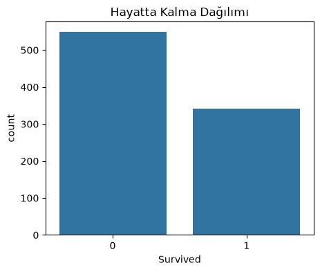
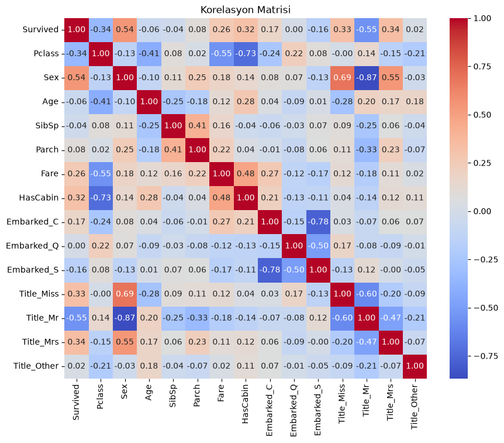
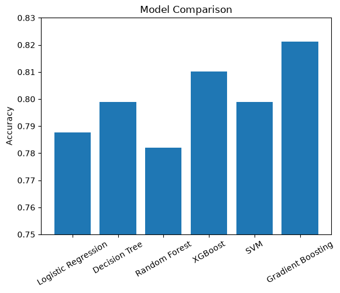

# 🚢 Titanic Machine Learning Project

This project applies a complete **Machine Learning workflow** to the Titanic dataset, from data extraction and preprocessing to model training, evaluation, comparison, and prediction.

## 📌 About the Project

The Titanic dataset is stored in **SQL Server** and retrieved using SQLAlchemy. The data is then cleaned and prepared using Python before training multiple classification models.

The project includes:

* Data extraction from SQL Server
* Data cleaning and missing value handling
* Feature engineering
* Categorical variable encoding
* Data visualization and correlation analysis
* Training and comparison of multiple ML models
* Model performance evaluation
* Prediction for new passengers

## 🧠 Machine Learning Models

* Logistic Regression
* Decision Tree
* Random Forest
* XGBoost
* Support Vector Machine (SVM)
* Gradient Boosting

## 🛠️ Technologies & Libraries

* **Python**
* **SQL Server**
* **SQLAlchemy**
* **Pandas**
* **NumPy**
* **Scikit-learn**
* **XGBoost**
* **Matplotlib**
* **Seaborn**

## 📊 Model Evaluation

Models are evaluated using:

* Accuracy
* Precision
* Recall
* F1 Score
* Confusion Matrix
* Classification Report

The models are also compared based on their accuracy scores to identify the best-performing model.

## 🔄 Workflow

**SQL Server → Data Extraction → Data Preprocessing → Feature Engineering → Model Training → Model Evaluation → Model Comparison → Prediction**

## 🎯 Best Model

Among the tested models, **Gradient Boosting** achieved the highest accuracy with approximately **82.12%** on the test set.
## 🎯 Model Results

| Model                 |   Accuracy |
| --------------------- | ---------: |
| Logistic Regression   |     78.77% |
| Decision Tree         |     79.89% |
| Random Forest         |     78.21% |
| XGBoost               |     81.01% |
| SVM                   |     79.89% |
| **Gradient Boosting** | **82.12%** |

**Gradient Boosting** achieved the highest accuracy among the tested models with an accuracy of **82.12%** on the test set.

## 📊 Data Analysis

### Survival Distribution

### Correlation Matrix

## 📈 Model Comparison

## 👩‍💻 Author

**Sevinç Çakar**
Management Information Systems Student
Interested in **Data Analytics, Artificial Intelligence & Machine Learning**.
